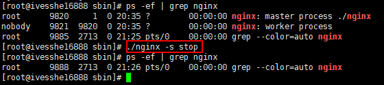
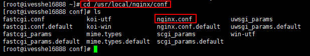
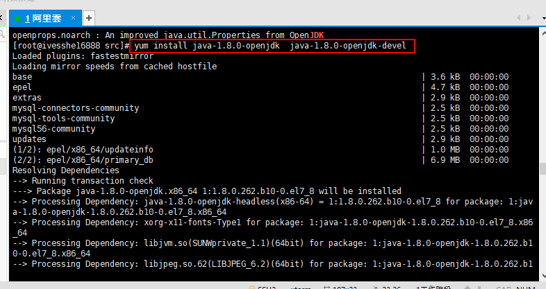
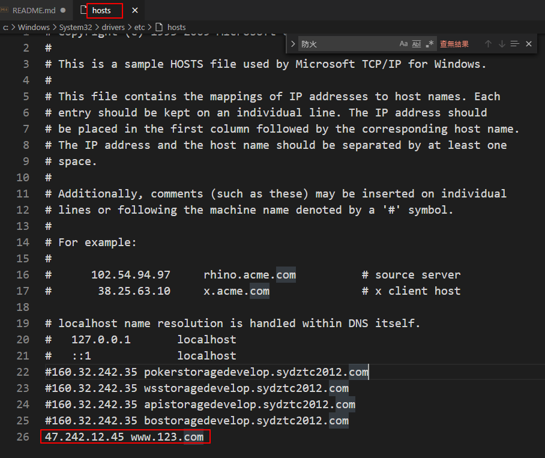

# Nginx Study
學習之後，製作成筆記，方便日後使用時復習
## 練習
- 反向代理
- 負載均衡
- 動靜分離

# 在Linux 安裝 Nginx
# 下載Nginx安裝包
版本1.12.2
- [nginx下載](http://nginx.org/en/download.html)

 

# 下載並安裝pcre依賴
```shell
wget http://downloads.sourceforge.net/project/pcre/pcre/8.37/pcre-8.37.tar.gz
```

 

解壓縮
```shell
mv pcre-8.37.tar.gz  /usr/src
cd /usr/src
tar -xvf pcre-8.37.tar.gz
```

 

安裝pcre依賴
```shell
cd pcre-8.37
./configure
```
 

```shell
make && make install
```


查看版本號
```shell
pcre-config --version
```


# 安裝其它的依賴

```shell
yum -y install make zlib zlib-devel gcc-c++ libtool openssl openssl-devel
```


# 安裝Nginx

上傳至linux主機


解壓縮
```shell
tar -xvf nginx-1.12.2.tar.gz
```


```shell
./configure
```


安裝
```shell
make && make install
```


啟動並查看
```shell
cd /usr/local/nginx/sbin/
./nginx 
ps -ef | grep nginx
```


查看設定檔
```shell
vim nginx.conf
```


在阿里雲要把80端口安全組配置打開


訪問該主機，看見Nginx的歡迎畫面了


# 防火牆
一般linux主機使用以下指令，阿里雲主機需在網頁設置安全組
## 查看開放的端口號
```shell
firewall-cmd --list-all
```


## 設置開放的端口號
```shell
# firewall-cmd -add-service=http -permanent
sudo firewall-cmd --add-port=80/tcp --permanent
```

## 重啟防火牆
```shell
firewall-cmd --reload
```


# Nginx操作的常用命令
**使用nginx操作命令前提條件，必須進入nginx的目錄**
```shell
cd /usr/local/nginx/sbin
```


## 查看nginx的版本號
```shell
./nginx -v
```


## 啟動nginx
```shell
./nginx
```


## 關閉nginx的
```shell
ps -ef | grep nginx
./nginx -s stop

```


## 重新加載nginx
```shell
./nginx -s reload
```


# nginx 配置文件
## 配置文件位置

```shell
cd /usr/local/nginx/conf
# nginx.conf
```


## nginx.conf分三大區塊
1. 全區塊
2. events塊
3. http塊

```shell
vim nginx.conf
```


```shell
# 全區塊
# worker_processes值愈大，可以支持的並發處理量也越多
worker_processes  1;
```

```shell
# events塊
# events塊涉及的指令主要影響nginx服務器與用戶的網路連接
# 比如worker_connections 1024; 支持的最大連接數
events {
    worker_connections  1024;
}
```

# nginx 配置實例1 - 反向代理

## 實現效果
打開瀏覽器，輸入位置www.123.com，跳轉linux系統tomcat主頁面中。

# 准備工作
- 在linux系統安裝tomcat，使用默認端口8080


```shell
tar -xvf apache-tomcat-7.0.70.tar.gz 
```
解壓


# 安裝JDK

檢查有無JAVA環境及可安裝的版本
```shell
yum search java | grep -i --color JDK
```


下載及安裝jdk 1.8
```shell
yum install java-1.8.0-openjdk  java-1.8.0-openjdk-devel 
```


設置環境變數
```shell
vim  /etc/profile
```


將這三行貼至該檔案最後
```shell
# export JAVA_HOME=/usr/lib/jvm/java-1.8.0-openjdk-1.8.0.51.x86_64
export JAVA_HOME=/usr/lib/jvm/java-1.8.0-openjdk-1.8.0.262.b10-0.el7_8.x86_64/
export CLASSPATH=.:$JAVA_HOME/jre/lib/rt.jar:$JAVA_HOME/lib/dt.jar:$JAVA_HOME/lib/tools.jar
export PATH=$PATH:$JAVA_HOME/bin
```


執行該指令，讓設置立即生效
```shell
source  /etc/profile 
```

輸入以下指令，檢查變量設置
```shell
echo $JAVA_HOME
echo $CLASSPATH
echo $PATH
```

測試是否安裝成功
```shell
java -version
```


# 啟動tomcat
```shell
cd /usr/src
cd apache-tomcat-7.0.70
cd bin
./startup.sh
```

## 查看日誌
```shell
cd ..
cd logs/
tail -f catalina.out 
```


## 需先開啟阿里雲端口8080，才能被訪問


# 防火牆
一般linux主機使用以下指令，阿里雲主機需在網頁設置安全組
## 查看開放的端口號
```shell
firewall-cmd --list-all
```


## 設置開放的端口號
```shell
sudo firewall-cmd --add-port=8080/tcp --permanent
```

## 重啟防火牆
```shell
firewall-cmd --reload
```


```shell
# 這邊其實是有碰到一些問題，後來發現是JAVA_HOME輸入錯誤
/usr/lib/jvm/java-1.8.0-openjdk-1.8.0.51.x86_64/bin/java: No such file or directory
```

# tomcat啟動成功


# 實現效果
打開瀏覽器，輸入位置www.123.com，跳轉linux系統tomcat主頁面中。

## 設定windows的host




 

## 修改nginx.conf，實現由nginx轉發至tomcat


```shell
server_name  47.242.12.45;

location / {
    root   html;
    proxy_pass http://127.0.0.1:8080;
    index  index.html index.htm;
}
```


反向代理成功


# nginx 配置實例2 - 反向代理

## 實現效果
- 使用nginx反向代理，根據訪問的路徑跳轉到不同端口的服務中，nginx監聽端口為9001
- 訪問http:127.0.0.1:9001/edu/ 直接跳轉到127.0.0.1:8080
- 訪問http:127.0.0.1:9001/vod/ 直接跳轉到127.0.0.1:8081

## 準備工作
- 準備兩個tomcat服務器，一個8080端口，一個8081端口

建立兩個資料夾


檢查現在執行中的tomcat，並先關閉它

```shell
ps -ef | grep tomcat
kill -g 14192
ps -ef | grep tomcat
```


## 解壓並啟動tomcat8080


## 解壓並啟動tomcat8081
8081端口需修改conf

```shell
cd apache-tomcat-7.0.70
cd conf
vim server.xml
```


## 需先開啟阿里雲端口8081，才能被訪問


# linux在對應的位置，新增資料夾及測試用的html頁面


# 修改nginx配置文件

```shell
cd /usr/local/nginx/conf
vim nginx.conf
```
```shell
server {
 86         listen       9001;
 87         server_name  47.242.12.45;
 88 
 89         location ~ /edu/ {
 90             proxy_pass http://127.0.0.1:8080;
 91         }
 92 
 93         location ~ /vod/ {
 94             proxy_pass http://127.0.0.1:8081;
 95         }
 96 
 97     }

```


## 需先開啟阿里雲端口9001，才能被訪問


# 重啟nginx
```shell
cd /usr/local/nginx/sbin
./nginx -s stop
./nginx
```


# 檢查結果


# nginx 配置實例 - 負載均衡

## 實現效果
- 瀏覽器輸入http://47.242.12.45:8080/edu/a.html，負載均衡效果，平均分擔到8080和8081的端口中

- 準備工作
準備兩台tomca服務器，一台8080、一台8081

- 在對應的資料夾放置測試用html


# 修改nginx配置文件

```shell
cd /usr/local/nginx/conf
vim nginx.conf
```
```shell
upstream myserver { 
    server 47.242.12.45:8080;
    server 47.242.12.45:8081; 
}   
server {
    listen       80; 
    server_name  47.242.12.45;

    #charset koi8-r;

    #access_log  logs/host.access.log  main;

    location / { 
        root   html;
        proxy_pass http://myserver;
        index  index.html index.htm;
    }  

```


## 重新加載nginx
```shell
cd /usr/local/nginx/sbin
./nginx -s reload
```

# 測試結果
http://47.242.12.45:8081/edu/a.html


# nginx分配服務器的策略
> 1、輪詢(默認值)

> 2、weight 權重 

權重愈高被分配的客戶端越多

```shell
upstream myserver { 
    server 47.242.12.45:8080 weight=5;
    server 47.242.12.45:8081 weight=10; 
}
```

> 3、ip_hash

每個請求按訪問ip的hash結果分配，這樣每個訪客固定訪問一個後端服務器，可以解決session的問題

```shell
upstream myserver { 
    ip_hash;
    server 47.242.12.45:8080;
    server 47.242.12.45:8081; 
}
```

> 4、fair(第三方)

按後端服務器的響應時間來分配請求，響應時間短的優先分配

```shell
upstream myserver { 
    server 47.242.12.45:8080;
    server 47.242.12.45:8081; 
    fair;
}
```

# nginx 配置實例 - 動靜分離

## 實現效果
- 瀏覽器輸入http://47.242.12.45:8080/edu/a.html，負載均衡效果，平均分擔到8080和8081的端口中

- 準備工作
準備兩台tomca服務器，一台8080、一台8081

- 在對應的資料夾放置測試用html


# 修改nginx配置文件

```shell
cd /usr/local/nginx/conf
vim nginx.conf
```
```shell
upstream myserver { 
    server 47.242.12.45:8080;
    server 47.242.12.45:8081; 
}   
server {
location /www/ {
        root   /data/;
        index  index.html index.htm;
    }

    location /image/ {
        root /data/;
        autoindex on;
    }
```


## 重新加載nginx
```shell
cd /usr/local/nginx/sbin
./nginx -s reload
```

# 結果測試

因為有配置文件 autoindex on

http://47.242.12.45/image/


http://47.242.12.45/image/go.png


http://47.242.12.45/www/c.html


# nginx 配置實例 - 配置高可用的集群

## 實現效果
- 準備工作
需要準備兩台主機，分別安裝nginx服務器，並在兩台服務器上安裝keepalived

**keepalived，這要兩台服務器，先暫時不練習實作**

筆記到P14